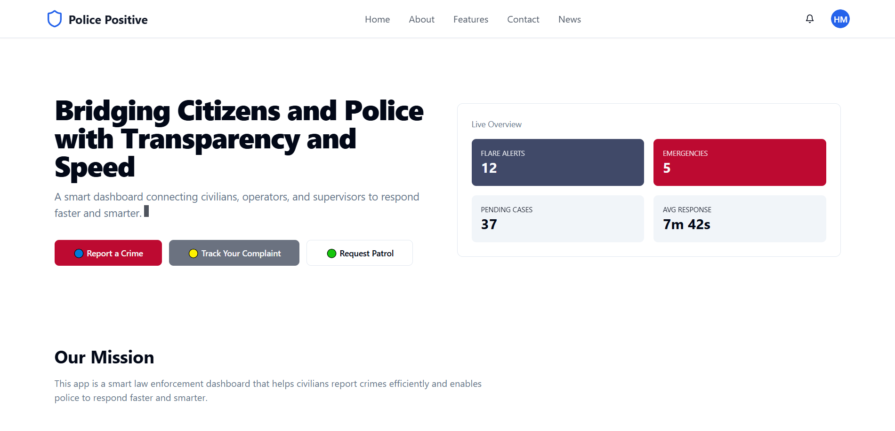
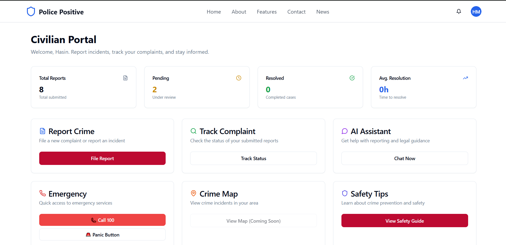
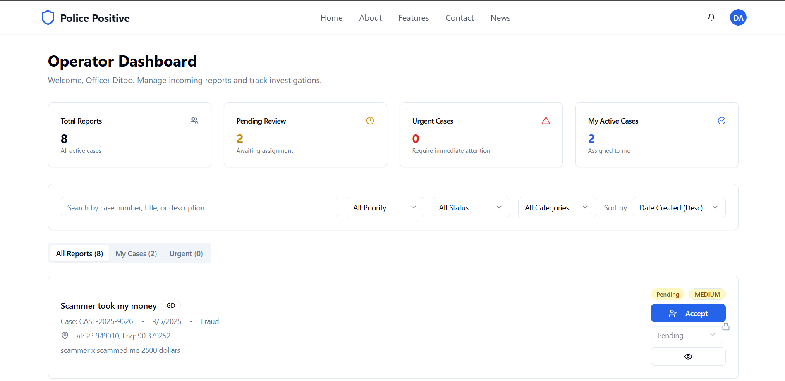
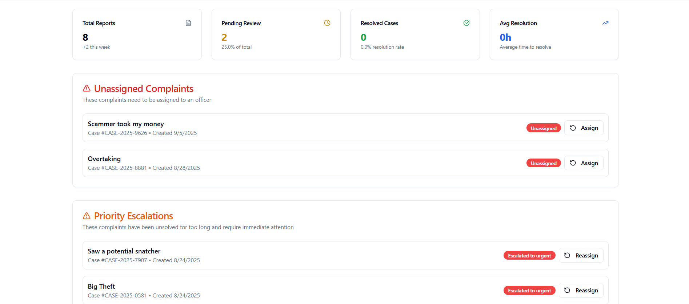

# 🚔 Police Positive
**Modern police operations made simple** — a full-stack web application with secure authentication, role-based dashboards, and incident management tools.
---
## 📸 Demo Pictures
        
</div>

## ✨ Features at a Glance

- **🔐 JWT-Based Authentication**
  - Secure registration and login with hashed passwords
  - Role-based access control: `civilian`, `operator`, `supervisor`, `patrol`

- **📊 Role-Specific Dashboards**
  - **Operators**: manage cases, file incident reports, coordinate patrols
  - **Supervisors**: oversee reports, assign tasks, monitor performance

- **🎨 User-Friendly Frontend**
  - Built with **React**, **Vite**, and **TypeScript**
  - Styled using **TailwindCSS** and **Shadcn/UI**
  - Toast notifications for real-time feedback

- **⚡ Scalable Backend**
  - **Node.js** + **Express** server
  - **MongoDB** via Mongoose for data persistence
  - Clean architecture with controllers, middleware, and RESTful routes

- **🌐 Centralized Auth State**
  - React Context + `useReducer` for global auth state management
  - Automatic session persistence and verification on app load

---

## 🛠 Tech Stack

| Frontend | Backend |
|----------|---------|
| React (Vite + TS + Shadcn/UI) | Node.js & Express |
| TailwindCSS | MongoDB + Mongoose |
| React Context API | JWT Authentication |
| Sonner for Toasts | Dotenv for Environment Config |

---

## 🚀 Installation & Setup

### 1️⃣ Clone the repo:
```bash
git clone https://github.com/Dipto6969/Police-Positive.git
cd Police-Positive

```
2️⃣ Setup Backend
````
cd server
npm install
# Copy .env.example → .env and add your env vars:
# PORT, MONGO_URI, JWT_SECRET
npm run server
````
3️⃣ Setup Frontend
```
cd client
npm install
# Optionally set VITE_API_URL in .env to match backend URL
npm run dev
````
## 4️⃣ Access the app

-**Backend: http://localhost:5000 (or 5001 if you changed the port)**

-**Frontend: Vite’s dev server URL (usually http://localhost:5173)**

## 🔄 Usage & Flow

-**Register a new user with a role (Operator, Supervisor, etc.).**

-**Login, receive JWT, and gain access to role-specific features**.

-**Frontend stores token in localStorage, and context handles auth state.**

-**Protected routes verify token via backend middleware before granting access.**

-**Session persists on reload through the checkAuth context function, which validates token with /auth/verify.**

